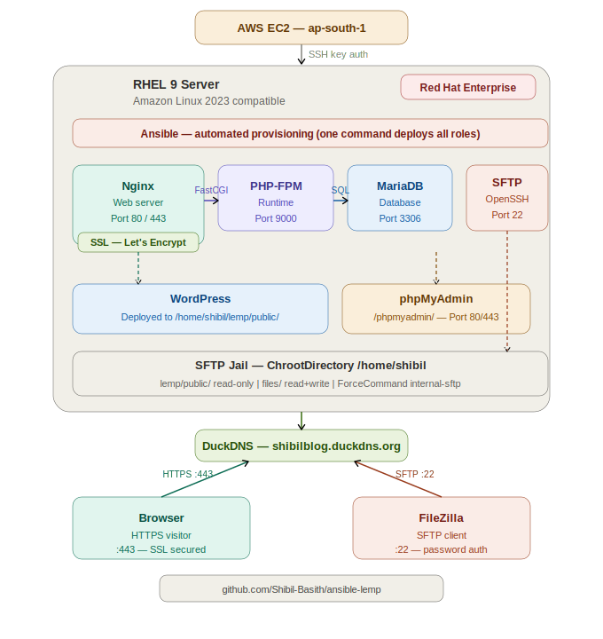

# 🚀 Ansible LEMP Stack Deployment

> Automate a full production-ready LEMP stack on **RHEL 9** with a single command —
> Nginx · MariaDB · PHP 8.3 · WordPress · phpMyAdmin · SFTP · SSL via Let's Encrypt.

[](https://www.ansible.com/)
[](https://nginx.org/)
[](https://mariadb.org/)
[](https://www.php.net/)
[](https://wordpress.org/)
[](https://letsencrypt.org/)
[](LICENSE)

---

## 📋 Table of Contents

- [Overview](#-overview)
- [Architecture](#-architecture)
- [Project Structure](#-project-structure)
- [Tech Stack](#-tech-stack)
- [Security First — Before You Start](#-security-first--before-you-start)
- [Prerequisites](#-prerequisites)
- [Quick Start](#-quick-start)
- [Configuration](#-configuration)
- [Roles](#-roles)
- [Variables Reference](#-variables-reference)
- [Accessing the Services](#-accessing-the-services)
- [SFTP File Access](#-sftp-file-access)
- [Verification Checklist](#-verification-checklist)
- [Troubleshooting](#-troubleshooting)
- [Author](#-author)

---

## 📖 Overview

This project automates the complete deployment of a **LEMP stack** (Linux, Nginx, MariaDB, PHP)
on an **AWS EC2** instance running **RHEL 9** using **Ansible roles**. Instead of manually
configuring each service, a single `ansible-playbook` command provisions the entire infrastructure —
idempotently and repeatably.

**What gets deployed automatically:**

| # | Component | What it does |
|---|---|---|
| 1 | **Nginx** | Web server + virtual host + firewall rules |
| 2 | **MariaDB** | Database server with full security hardening |
| 3 | **PHP 8.3 + FPM** | FastCGI runtime + all WordPress extensions |
| 4 | **WordPress** | Downloaded, extracted, configured via template |
| 5 | **phpMyAdmin 5.2.3** | Browser-based database administration |
| 6 | **SFTP jail** | Secure file access with ChrootDirectory |
| 7 | **Let's Encrypt SSL** | Free TLS cert + HTTPS redirect + auto-renewal |

---

## 🏗 Architecture



> **Flow:** Browser and FileZilla clients connect through DuckDNS DNS to the RHEL 9 server.
> Nginx routes HTTPS traffic to PHP-FPM (FastCGI on port 9000) which talks to MariaDB.
> SFTP clients connect directly to OpenSSH on port 22 and are jailed to `/home/shibil`.
> Everything is provisioned by Ansible in a single playbook run.

---

## 📁 Project Structure

```
ansible-lemp/
├── ansible.cfg                  # Ansible runtime configuration
├── inventory                    # Target host IP (keep private — see Security)
├── playbook.yml                 # Main playbook — ties all roles together
├── .gitignore                   # Excludes vault.yml, inventory, secrets
├── group_vars/
│   └── all/
│       └── vault.yml            # Ansible Vault encrypted secrets ONLY
├── nginx/
│   ├── tasks/main.yml           # Install Nginx, firewall, web root, vhost
│   ├── handlers/main.yml        # restart nginx
│   ├── defaults/main.yml
│   └── templates/
│       ├── nginx.conf.j2        # Virtual host Jinja2 template
│       └── index.php.j2         # PHP test page
├── mariadb/
│   ├── tasks/main.yml           # Install MariaDB, harden, create DB + user
│   └── handlers/main.yml
├── php/
│   ├── tasks/main.yml           # PHP-FPM + WordPress + phpMyAdmin deploy
│   ├── handlers/main.yml        # restart php-fpm
│   ├── vars/main.yml            # DB variable names (values in vault.yml)
│   └── templates/
│       ├── wp-config.php.j2     # WordPress config template
│       └── www.conf.j2          # PHP-FPM pool config
├── sftp/
│   ├── tasks/main.yml           # Create user, configure SFTP jail
│   ├── handlers/main.yml        # restart sshd
│   └── defaults/main.yml        # sftp_user, sftp_home (no passwords here)
├── ssl/
│   ├── tasks/main.yml           # Install Certbot, obtain cert, cron
│   └── defaults/main.yml        # domain_name, email
└── docs/
    └── architecture.png         # Architecture diagram
```

---

## 🛠 Tech Stack

| Component | Technology | Version |
|---|---|---|
| Operating System | RHEL 9 (Red Hat Enterprise Linux) | 9.x |
| Cloud Provider | AWS EC2 | ap-south-1 |
| Web Server | Nginx | 1.26.3 |
| Database | MariaDB | 10.11.15 |
| PHP Runtime | PHP + PHP-FPM | 8.3.29 |
| CMS | WordPress | Latest |
| DB Admin UI | phpMyAdmin | 5.2.3 |
| SSL Certificate | Let's Encrypt (Certbot) | certbot-nginx |
| File Transfer | OpenSSH SFTP | internal-sftp |
| Automation | Ansible | Roles-based playbook |
| DNS | DuckDNS | Free subdomain |

---

## 🔐 Security First — Before You Start

> **This section is mandatory reading before cloning or deploying.**
> The default repo contains placeholder values. You must replace every secret
> before running the playbook. Never commit real credentials to Git.

### 1 — Use Ansible Vault for All Secrets

All passwords, keys, and sensitive values must live in an **encrypted vault file**,
never in plain-text `vars/` or `defaults/` files.

**Create your vault file:**
```bash
ansible-vault create group_vars/all/vault.yml
```

**Add all secrets inside it:**
```yaml
# group_vars/all/vault.yml  (encrypted — never commit unencrypted)
vault_sftp_password:    "YourStrongSFTPPassword123!"
vault_wp_db_password:   "YourStrongDBPassword456!"
vault_db_root_password: "YourStrongRootPassword789!"
```

**Reference vault variables in role files:**
```yaml
# sftp/defaults/main.yml
sftp_password: "{{ vault_sftp_password }}"

# php/vars/main.yml
wp_db_password: "{{ vault_wp_db_password }}"
```

**Run the playbook with vault decryption:**
```bash
ansible-playbook playbook.yml -i inventory --ask-vault-pass
```

Or store the vault password in a protected file (never commit this file):
```bash
echo "YourVaultPassword" > ~/.vault_pass.txt
chmod 600 ~/.vault_pass.txt
ansible-playbook playbook.yml -i inventory --vault-password-file ~/.vault_pass.txt
```

---

### 2 — Add a .gitignore

Create this `.gitignore` at the project root **before your first `git push`**:

```gitignore
# Ansible secrets — NEVER commit these
group_vars/all/vault.yml
inventory
*.retry
.vault_pass.txt
*.pem
*.key

# OS and editor noise
.DS_Store
.idea/
*.swp
__pycache__/
```

> If you have already committed plain-text secrets by mistake,
> rotate every affected password immediately and use
> `git filter-branch` or `git-filter-repo` to scrub the history.

---

### 3 — Strong Password Requirements

All passwords used in this project must meet these minimum requirements:

| Requirement | Rule |
|---|---|
| Length | At least 16 characters |
| Uppercase | At least 1 uppercase letter |
| Lowercase | At least 1 lowercase letter |
| Numbers | At least 1 number |
| Special characters | At least 1 special character (`! @ # $ % ^ & *`) |
| Avoid dictionary words | Do not use names, dates, or common words |

**Generate a strong random password instantly:**
```bash
# Linux / macOS
openssl rand -base64 24

# Python
python3 -c "import secrets; print(secrets.token_urlsafe(24))"
```

---

### 4 — AWS EC2 Security Group Rules

Only open the ports your application actually needs:

| Port | Protocol | Source | Purpose |
|---|---|---|---|
| 22 | TCP | Your IP only (`x.x.x.x/32`) | SSH and SFTP access |
| 80 | TCP | `0.0.0.0/0` | HTTP (redirects to HTTPS) |
| 443 | TCP | `0.0.0.0/0` | HTTPS — WordPress and phpMyAdmin |

> **Never open port 22 to `0.0.0.0/0` (the whole internet).**
> Restrict SSH/SFTP to your own IP address only.
> If your IP changes, update the Security Group rule — do not open it wide.

---

### 5 — Post-Deployment Hardening

Apply these steps after the playbook runs for a production-ready server:

```bash
# Disable root SSH login
echo "PermitRootLogin no" >> /etc/ssh/sshd_config
systemctl restart sshd

# Set up automatic security updates (RHEL 9)
dnf install dnf-automatic -y
systemctl enable --now dnf-automatic-install.timer

# Install fail2ban to block brute-force login attempts
dnf install fail2ban -y
systemctl enable --now fail2ban

# Verify only expected ports are open (22, 80, 443)
ss -tlnp

# Verify SELinux is enforcing
getenforce
```

**Restrict phpMyAdmin access by IP in Nginx:**
```nginx
location /phpmyadmin/ {
    allow YOUR.IP.ADDRESS.HERE;
    deny  all;
    alias /home/shibil/lemp/public/phpmyadmin/;
}
```

**Add these to `wp-config.php` after WordPress install:**
```php
// Disable file editing from WordPress dashboard
define('DISALLOW_FILE_EDIT', true);

// Force SSL for admin panel and login page
define('FORCE_SSL_ADMIN', true);
```

---

## ✅ Prerequisites

**On your control machine:**
```bash
# Install Ansible
pip install ansible --upgrade

# Install required POSIX collection (needed for firewalld module)
ansible-galaxy collection install ansible.posix

# Verify
ansible --version
```

**On your AWS EC2 instance:**
- RHEL 9 running (t2.micro or larger)
- SSH key pair configured for `ec2-user`
- Security Group configured as above

**DNS:**
- Domain pointed to your EC2 public IP (e.g. [DuckDNS](https://www.duckdns.org/) — free)
- DNS must be propagated before running the ssl role

---

## ⚡ Quick Start

### Step 1 — Clone the repository
```bash
git clone https://github.com/Shibil-Basith/ansible-lemp.git
cd ansible-lemp
```

### Step 2 — Create your encrypted vault file
```bash
ansible-vault create group_vars/all/vault.yml
```
Add your secrets inside:
```yaml
vault_sftp_password:    "YourStrongSFTPPassword!"
vault_wp_db_password:   "YourStrongDBPassword!"
vault_db_root_password: "YourStrongRootPassword!"
```

### Step 3 — Update the inventory
```ini
# inventory
[lemp]
YOUR_SERVER_PRIVATE_IP
```

### Step 4 — Set your domain and email
```yaml
# ssl/defaults/main.yml
domain_name: your-domain.example.com
email:       your-email@example.com
```

### Step 5 — Set SFTP user configuration
```yaml
# sftp/defaults/main.yml
sftp_user:       your_username
sftp_home:       /home/your_username
sftp_upload_dir: files
sftp_password:   "{{ vault_sftp_password }}"
```

### Step 6 — Set WordPress database variables
```yaml
# php/vars/main.yml
wp_db_name:     wordpress
wp_db_user:     your_db_user
wp_db_password: "{{ vault_wp_db_password }}"
wp_db_host:     localhost
```

### Step 7 — Check syntax before deploying
```bash
ansible-playbook playbook.yml --syntax-check
```

### Step 8 — Deploy the full stack
```bash
ansible-playbook playbook.yml -i inventory --ask-vault-pass
```

> Deployment takes approximately **3–5 minutes** on a fresh server.

### Step 9 — Complete WordPress setup
```
https://your-domain.example.com
```
Follow the on-screen WordPress installation wizard to set your site title,
admin username, password, and email.

---

## ⚙️ Configuration

### ansible.cfg
```ini
[defaults]
inventory   = /home/ec2-user/ansible-lemp/inventory
remote_user = ec2-user
ask_pass    = false

[privilege_escalation]
become          = true
become_user     = root
become_method   = sudo
become_ask_pass = false
```

### playbook.yml
```yaml
---
- name: Install LEMP Stack
  hosts: lemp
  become: yes

  vars:
    ansible_python_interpreter: /usr/bin/python3

  roles:
    - nginx      # Step 1: Web server + firewall + web root
    - mariadb    # Step 2: Database server + WordPress DB
    - php        # Step 3: PHP-FPM + WordPress + phpMyAdmin
    - sftp       # Step 4: Secure file access for user
    - ssl        # Step 5: HTTPS via Let's Encrypt
```

> `ansible_python_interpreter` is explicitly set to `/usr/bin/python3` to prevent
> auto-detection issues on RHEL 9.

---

## 📦 Roles

### 🟢 nginx — Web Server

Installs Nginx, configures firewalld, creates the web root, and deploys the
virtual host configuration via a Jinja2 template.

**Key tasks:**
- Install `nginx` and `firewalld` via `dnf`
- Create web root at `/home/<user>/lemp/public` owned by `nginx:nginx`
- Deploy virtual host config from `nginx.conf.j2`
- Open HTTP (80) and HTTPS (443) in firewalld with `--permanent`
- Start and enable Nginx as a system service

**nginx.conf.j2 — Virtual host template:**
```nginx
server {
    listen 80;
    server_name your-domain.example.com www.your-domain.example.com;

    root  /home/shibil/lemp/public;
    index index.php index.html;

    location / {
        try_files $uri $uri/ /index.php?$query_string;
    }

    location ~ \.php$ {
        include fastcgi_params;
        fastcgi_pass  127.0.0.1:9000;
        fastcgi_param SCRIPT_FILENAME $document_root$fastcgi_script_name;
    }

    location /phpmyadmin/ {
        alias /home/shibil/lemp/public/phpmyadmin/;
        index index.php;
    }

    location ~ ^/phpmyadmin/(.+\.php)$ {
        alias             /home/shibil/lemp/public/phpmyadmin/$1;
        include           fastcgi_params;
        fastcgi_pass      127.0.0.1:9000;
        fastcgi_param     SCRIPT_FILENAME /home/shibil/lemp/public/phpmyadmin/$1;
    }

    # Deny access to hidden files (.htaccess etc.)
    location ~ /\. {
        deny all;
    }
}
```

> After the `ssl` role runs, Certbot automatically adds `listen 443 ssl`,
> SSL certificate paths, and an HTTP to HTTPS redirect to this file.

---

### 🔵 mariadb — Database Server

Installs MariaDB and applies security hardening equivalent to
`mysql_secure_installation`, then provisions the WordPress database and user.

**Key tasks:**
- Install `mariadb-server` and `python3-PyMySQL`
- Detect and handle three root password scenarios (no password / known / unknown)
- Create `/root/.my.cnf` with mode `0600` for passwordless root CLI access
- Remove anonymous users, remote root login, and test database
- Create `wordpress` database and application user with scoped `wordpress.*:ALL` privileges

**Security note:** Remote root login is explicitly removed. The application user
(`shibil`) only has privileges on the `wordpress` database — not on all databases.

---

### 🟣 php — PHP-FPM, WordPress & phpMyAdmin

Installs PHP 8.3, configures PHP-FPM, deploys WordPress and phpMyAdmin,
generates `wp-config.php` from a template, fixes ownership, and applies
SELinux contexts.

**PHP extensions installed:**

| Extension | Purpose |
|---|---|
| `php-fpm` | FastCGI Process Manager |
| `php-mysqlnd` | MySQL native driver (required by WordPress) |
| `php-mbstring` | Multi-byte string functions |
| `php-zip` | ZIP archive support |
| `php-json` | JSON encode/decode |

**PHP-FPM pool config (www.conf.j2):**
```ini
[www]
user  = nginx
group = nginx

listen       = 127.0.0.1:9000
listen.owner = nginx
listen.group = nginx
listen.mode  = 0660

pm                   = dynamic
pm.max_children      = 50
pm.start_servers     = 5
pm.min_spare_servers = 5
pm.max_spare_servers = 35

slowlog                    = /var/log/php-fpm/www-slow.log
php_admin_value[error_log] = /var/log/php-fpm/www-error.log
php_admin_flag[log_errors] = on
```

**WordPress config template (wp-config.php.j2):**
```php
<?php
define('DB_NAME',     '{{ wp_db_name }}');
define('DB_USER',     '{{ wp_db_user }}');
define('DB_PASSWORD', '{{ wp_db_password }}');
define('DB_HOST',     '{{ wp_db_host }}');
define('DB_CHARSET',  'utf8');

$table_prefix = 'wp_';
define('WP_DEBUG', false);

if ( !defined('ABSPATH') )
    define('ABSPATH', __DIR__ . '/');

require_once ABSPATH . 'wp-settings.php';
```

**SELinux contexts applied:**
```bash
chcon -Rt httpd_sys_content_t /home/shibil/lemp
setsebool -P httpd_can_network_connect 1
```

---

### 🟠 sftp — Secure File Transfer

Configures an SFTP-only jail. The user can upload files via SFTP but
cannot access a shell session.

**Key tasks:**
- Create Linux user with SHA-512 hashed password via `password_hash('sha512')`
- Enable `PasswordAuthentication` in `/etc/ssh/sshd_config`
- Enable `PasswordAuthentication` in `/etc/ssh/sshd_config.d/50-cloud-init.conf`
- Add `Match User` block with `ChrootDirectory` and `ForceCommand internal-sftp`
- Set chroot directory owned `root:root` mode `0755` (required by sshd)
- Create writable upload directory owned by the SFTP user

**Resulting SSH config block:**
```
Match User shibil
    ChrootDirectory    /home/shibil
    ForceCommand       internal-sftp
    X11Forwarding      no
    AllowTcpForwarding no
    PasswordAuthentication yes
```

**Directory permissions inside the jail:**
```
/home/shibil/              → Jail root      (root:root   0755)   browse only
/home/shibil/lemp/public/  → Web root       (nginx:nginx)        read only
/home/shibil/files/        → Upload dir     (shibil:shibil)      read + write
```

> `ForceCommand internal-sftp` means the user is always dropped into the SFTP
> subsystem regardless of what they request. Shell access is impossible.

---

### 🔴 ssl — HTTPS via Let's Encrypt

Installs Certbot, obtains a free TLS certificate, configures Nginx for HTTPS,
and sets up automatic daily renewal via cron.

**Key tasks:**
- Install `python3`, `python3-pip`, `certbot`, `certbot-nginx` via pip3
- Confirm Nginx is listening on port 80 before running Certbot
- Run `certbot --nginx` — automatically edits Nginx config for SSL
- Set up daily auto-renewal cron at 03:00

**Certbot command:**
```bash
certbot --nginx \
  -d your-domain.example.com \
  --non-interactive \
  --agree-tos \
  --email your-email@example.com \
  --redirect
```

**Auto-renewal cron (daily at 03:00):**
```
0 3 * * * /usr/local/bin/certbot renew --quiet && systemctl reload nginx
```

> Certificates expire after 90 days. Certbot renews automatically when fewer
> than 30 days remain — zero manual intervention needed.

---

## 🔧 Variables Reference

| Variable | File | Description | Use Vault? |
|---|---|---|---|
| `sftp_user` | `sftp/defaults/main.yml` | SFTP Linux username | No |
| `sftp_home` | `sftp/defaults/main.yml` | Home directory and chroot root | No |
| `sftp_upload_dir` | `sftp/defaults/main.yml` | Name of writable subdirectory | No |
| `sftp_password` | `sftp/defaults/main.yml` | SFTP login password | **Yes** |
| `domain_name` | `ssl/defaults/main.yml` | Your fully qualified domain name | No |
| `email` | `ssl/defaults/main.yml` | Email for Let's Encrypt notifications | No |
| `wp_db_name` | `php/vars/main.yml` | WordPress database name | No |
| `wp_db_user` | `php/vars/main.yml` | WordPress database username | No |
| `wp_db_password` | `php/vars/main.yml` | WordPress database password | **Yes** |
| `wp_db_host` | `php/vars/main.yml` | Database host | No |

All variables marked **Yes** must be stored in `group_vars/all/vault.yml`
and referenced using `{{ vault_variable_name }}` syntax. Never store them
in plain text.

---

## 🌐 Accessing the Services

| Service | URL | Notes |
|---|---|---|
| WordPress site | `https://your-domain.example.com` | Public |
| WordPress admin | `https://your-domain.example.com/wp-admin/` | WP login required |
| phpMyAdmin | `https://your-domain.example.com/phpmyadmin/` | Restrict by IP in production |
| SFTP | `sftp://your-domain.example.com` — Port 22 | SFTP credentials required |

---

## 📂 SFTP File Access

Connect using any SFTP client (e.g. FileZilla):

```
Protocol : SFTP — SSH File Transfer Protocol
Host     : your-domain.example.com
Port     : 22
Username : shibil
Password : (from your vault)
```

**Directory tree inside the jail:**
```
/                           ← You land here (maps to /home/shibil on server)
├── lemp/
│   └── public/             ← WordPress files — read only
│       ├── wp-admin/
│       ├── wp-content/
│       ├── wp-includes/
│       ├── wp-config.php
│       └── phpmyadmin/
└── files/                  ← Your writable upload directory
```

---

## ✅ Verification Checklist

```bash
# All services running
systemctl status nginx
systemctl status mariadb
systemctl status php-fpm

# HTTP redirects to HTTPS (expect: 301 Moved Permanently)
curl -I http://your-domain.example.com

# HTTPS responding
curl -Is https://your-domain.example.com | head -1

# SSL certificate validity dates
echo | openssl s_client -connect your-domain.example.com:443 2>/dev/null \
  | openssl x509 -noout -dates

# Firewall — should show: http https ssh
firewall-cmd --list-services

# SELinux enforcing
getenforce

# PHP-FPM listening on port 9000
ss -tlnp | grep 9000

# Only expected ports open (22, 80, 443)
ss -tlnp | grep -E ':22|:80|:443'
```

---

## 🛠 Troubleshooting

**502 Bad Gateway**
```bash
systemctl status php-fpm
ss -tlnp | grep 9000
systemctl restart php-fpm
journalctl -u php-fpm --no-pager -n 50
```

**403 Forbidden on WordPress or phpMyAdmin**
```bash
# Fix SELinux context
chcon -Rt httpd_sys_content_t /home/shibil/lemp
setsebool -P httpd_can_network_connect 1
setsebool -P httpd_can_network_connect_db 1

# Verify context applied
ls -lZ /home/shibil/lemp
```

**SFTP — Authentication failure**
```bash
# Both files must say: PasswordAuthentication yes
grep PasswordAuthentication /etc/ssh/sshd_config
grep PasswordAuthentication /etc/ssh/sshd_config.d/50-cloud-init.conf

# Test config for syntax errors before restarting
sshd -t
systemctl restart sshd
```

**SFTP — Cannot write files**
```bash
# files/ must be owned by the SFTP user
ls -la /home/shibil/
chown shibil:shibil /home/shibil/files
chmod 755 /home/shibil/files
```

**Certbot fails — domain not resolving**
```bash
# Verify DNS
dig your-domain.example.com

# Test port 80 reachability
curl -I http://your-domain.example.com

# Dry run (no certificate issued — safe to test)
certbot --nginx -d your-domain.example.com --dry-run
```

**MariaDB root password unknown**
```bash
systemctl stop mariadb
mysqld_safe --skip-grant-tables &
sleep 2
mysql -u root -e "ALTER USER 'root'@'localhost' IDENTIFIED BY 'NewStrongPassword!'; FLUSH PRIVILEGES;"
systemctl restart mariadb
```

---

## 👨‍💻 Author

**Shibil Basith**
Computer Science Postgraduate | Aspiring DevOps Engineer — Kerala, India

[](https://linkedin.com/in/shibilbasith)
[](https://github.com/Shibil-Basith)

> Built as part of hands-on DevOps training at **[IPSR Solutions Ltd](https://www.ipsr.in/)**

---

## 📄 License

This project is licensed under the MIT License — see the [LICENSE](LICENSE) file for details.

---

> ⭐ If this project helped you, please give it a star — it helps others find it!
