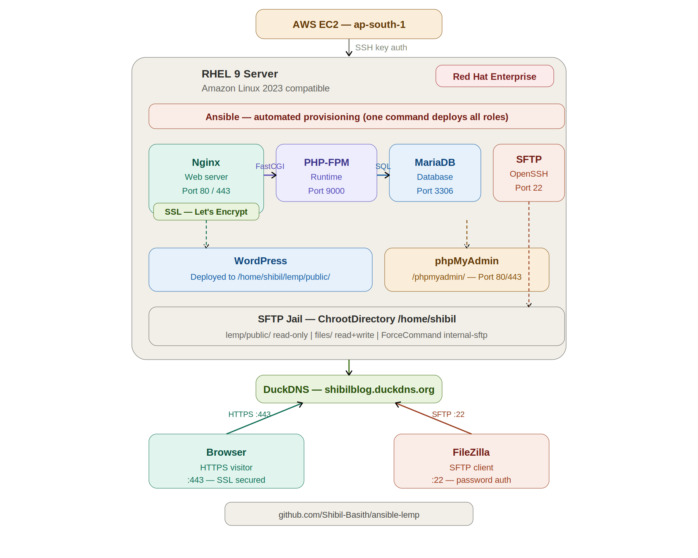

# 🚀 Ansible LEMP Stack Deployment

> Automate a full production-ready LEMP stack on RHEL 9 / Amazon Linux with a single command — Nginx, MariaDB, PHP 8.3, WordPress, phpMyAdmin, SFTP, and SSL via Let's Encrypt.

[](https://www.ansible.com/)
[](https://nginx.org/)
[](https://mariadb.org/)
[](https://www.php.net/)
[](https://wordpress.org/)
[](https://letsencrypt.org/)
[](LICENSE)

---

## 📋 Table of Contents

- [Overview](#-overview)
- [Architecture](#-architecture)
- [Project Structure](#-project-structure)
- [Tech Stack](#-tech-stack)
- [Prerequisites](#-prerequisites)
- [Quick Start](#-quick-start)
- [Configuration](#-configuration)
- [Roles](#-roles)
- [Variables Reference](#-variables-reference)
- [Accessing the Services](#-accessing-the-services)
- [SFTP File Access](#-sftp-file-access)
- [Troubleshooting](#-troubleshooting)
- [Author](#-author)

---

## 📖 Overview

This project automates the complete deployment of a **LEMP stack** (Linux, Nginx, MariaDB, PHP) on an AWS EC2 instance running **RHEL 9** using **Ansible roles**. Instead of manually configuring each service, a single `ansible-playbook` command provisions the entire infrastructure — idempotently and repeatably.

**What gets deployed automatically:**
- ✅ Nginx web server with virtual host configuration
- ✅ MariaDB with security hardening
- ✅ PHP 8.3 + PHP-FPM with all WordPress extensions
- ✅ WordPress (latest) with auto-generated `wp-config.php`
- ✅ phpMyAdmin 5.2.3 for database management
- ✅ SFTP access with ChrootDirectory jail
- ✅ Free SSL/TLS certificate via Let's Encrypt
- ✅ Firewall rules (HTTP + HTTPS) via firewalld
- ✅ SELinux context configuration
- ✅ Auto-renewal cron job for SSL certificate

---

## 🏗 Architecture


```

---

## 📁 Project Structure

```
ansible-lemp/
├── ansible.cfg                  # Ansible runtime configuration
├── inventory                    # Target host IP addresses
├── playbook.yml                 # Main playbook — ties all roles together
├── group_vars/
│   └── all/
│       └── vault.yml            # Encrypted secrets (Ansible Vault)
├── nginx/
│   ├── tasks/main.yml           # Install Nginx, firewall, web root, vhost
│   ├── handlers/main.yml        # restart nginx
│   ├── templates/
│   │   ├── nginx.conf.j2        # Virtual host Jinja2 template
│   │   └── index.php.j2         # PHP test page template
│   └── defaults/main.yml
├── mariadb/
│   ├── tasks/main.yml           # Install MariaDB, harden, create DB + user
│   └── handlers/main.yml
├── php/
│   ├── tasks/main.yml           # Install PHP, deploy WordPress + phpMyAdmin
│   ├── handlers/main.yml        # restart php-fpm
│   ├── vars/main.yml            # WordPress DB credentials
│   └── templates/
│       ├── wp-config.php.j2     # WordPress DB config template
│       └── www.conf.j2          # PHP-FPM pool config template
├── sftp/
│   ├── tasks/main.yml           # Create user, configure SFTP jail
│   ├── handlers/main.yml        # Restart sshd
│   └── defaults/main.yml        # sftp_user, sftp_home, sftp_password
└── ssl/
    ├── tasks/main.yml           # Install Certbot, obtain cert, set cron
    └── defaults/main.yml        # domain_name, email
```

---

## 🛠 Tech Stack

| Component | Technology | Version |
|---|---|---|
| Operating System | RHEL 9 (Red Hat Enterprise Linux) | 9.x |
| Cloud Provider | AWS EC2 | ap-south-1 |
| Web Server | Nginx | 1.26.3 |
| Database | MariaDB | 10.11.15 |
| PHP Runtime | PHP + PHP-FPM | 8.3.29 |
| CMS | WordPress | Latest |
| DB Admin UI | phpMyAdmin | 5.2.3 |
| SSL Certificate | Let's Encrypt (Certbot) | certbot-nginx |
| File Transfer | OpenSSH SFTP | internal-sftp |
| Automation | Ansible | Roles-based |
| DNS | DuckDNS | Free subdomain |

---

## ✅ Prerequisites

Before running the playbook, ensure the following are ready:

**On your control machine (where you run Ansible):**
```bash
# Install Ansible
pip install ansible

# Install required collection
ansible-galaxy collection install ansible.posix
```

**On your AWS EC2 instance:**
- RHEL 9 running (t2.micro or larger)
- SSH key pair configured for `ec2-user`
- Security Group inbound rules open for:
  - Port `22` — SSH
  - Port `80` — HTTP
  - Port `443` — HTTPS

**DNS:**
- A domain or subdomain pointed to your EC2 public IP
- Recommended: [DuckDNS](https://www.duckdns.org/) (free)

---

## ⚡ Quick Start

**1. Clone the repository**
```bash
git clone https://github.com/Shibil-Basith/ansible-lemp.git
cd ansible-lemp
```

**2. Update the inventory with your server IP**
```ini
# inventory
[lemp]
YOUR_SERVER_PRIVATE_IP
```

**3. Update your domain and email**
```yaml
# ssl/defaults/main.yml
domain_name: your-domain.example.com
email:       your-email@example.com
```

**4. Update SFTP user credentials**
```yaml
# sftp/defaults/main.yml
sftp_user:     your_username
sftp_home:     /home/your_username
sftp_password: YourStrongPassword
```

**5. Update WordPress database credentials**
```yaml
# php/vars/main.yml
wp_db_name:     wordpress
wp_db_user:     your_db_user
wp_db_password: YourDBPassword
wp_db_host:     localhost
```

**6. Run a syntax check**
```bash
ansible-playbook playbook.yml --syntax-check
```

**7. Deploy everything**
```bash
ansible-playbook playbook.yml -i inventory
```

> ⏱ Deployment takes approximately **3–5 minutes** on a fresh server.

**8. Complete WordPress setup**

Open your domain in a browser and follow the WordPress installation wizard:
```
https://your-domain.example.com
```

---

## ⚙️ Configuration

### ansible.cfg

```ini
[defaults]
inventory   = /home/ec2-user/ansible-lemp/inventory
remote_user = ec2-user
ask_pass    = false

[privilege_escalation]
become          = true
become_user     = root
become_method   = sudo
become_ask_pass = false
```

### playbook.yml

```yaml
---
- name: Install LEMP Stack
  hosts: lemp
  become: yes

  vars:
    ansible_python_interpreter: /usr/bin/python3

  roles:
    - nginx      # Step 1: Web server + firewall + web root
    - mariadb    # Step 2: Database server + WordPress DB
    - php        # Step 3: PHP-FPM + WordPress + phpMyAdmin
    - sftp       # Step 4: Secure file access for user
    - ssl        # Step 5: HTTPS via Let's Encrypt
```

---

## 📦 Roles

### 🟢 nginx
Installs and configures Nginx as a reverse proxy and web server.

**What it does:**
- Installs `nginx` and `firewalld` via `dnf`
- Creates the web root directory at `/home/<user>/lemp/public`
- Deploys the virtual host config from `nginx.conf.j2`
- Opens HTTP (80) and HTTPS (443) ports in firewalld
- Starts and enables the Nginx service

**Key template — nginx.conf.j2:**
```nginx
server {
    listen 80;
    server_name your-domain.example.com;
    root /home/shibil/lemp/public;
    index index.php index.html;

    location / {
        try_files $uri $uri/ /index.php?$query_string;
    }
    location ~ \.php$ {
        fastcgi_pass 127.0.0.1:9000;
        fastcgi_param SCRIPT_FILENAME $document_root$fastcgi_script_name;
        include fastcgi_params;
    }
    location /phpmyadmin/ {
        alias /home/shibil/lemp/public/phpmyadmin/;
    }
    location ~ /\. {
        deny all;
    }
}
```

---

### 🔵 mariadb
Installs MariaDB and applies full security hardening equivalent to `mysql_secure_installation`.

**What it does:**
- Installs `mariadb-server` and `python3-PyMySQL`
- Handles root password in all scenarios (no password / known password)
- Creates `/root/.my.cnf` for passwordless root CLI access
- Removes anonymous users, remote root login, and test database
- Creates the `wordpress` database and `shibil` user with full privileges

---

### 🟣 php
Installs PHP 8.3, configures PHP-FPM, deploys WordPress and phpMyAdmin.

**PHP extensions installed:**
| Extension | Purpose |
|---|---|
| `php-fpm` | FastCGI Process Manager |
| `php-mysqlnd` | MySQL native driver |
| `php-mbstring` | Multibyte string support |
| `php-zip` | ZIP archive support |
| `php-json` | JSON support |

**PHP-FPM pool config (www.conf.j2):**
```ini
[www]
user  = nginx
group = nginx
listen = 127.0.0.1:9000
pm = dynamic
pm.max_children      = 50
pm.start_servers     = 5
pm.min_spare_servers = 5
pm.max_spare_servers = 35
```

---

### 🟠 sftp
Configures secure SFTP access with a ChrootDirectory jail.

**What it does:**
- Creates the Linux user with a SHA-512 hashed password
- Enables `PasswordAuthentication` in `/etc/ssh/sshd_config`
- Enables `PasswordAuthentication` in `/etc/ssh/sshd_config.d/50-cloud-init.conf`
- Configures SSH `Match User` block with `ChrootDirectory` and `ForceCommand internal-sftp`
- Sets chroot directory ownership to `root:root` (required by sshd)
- Creates writable upload directory inside the jail

**Resulting SSH config block:**
```
Match User shibil
    ChrootDirectory    /home/shibil
    ForceCommand       internal-sftp
    X11Forwarding      no
    AllowTcpForwarding no
    PasswordAuthentication yes
```

**Directory permissions inside jail:**
```
/home/shibil/              → Jail root   (root:root  0755) — browse only
/home/shibil/lemp/public/  → Web root    (nginx:nginx)     — read only
/home/shibil/files/        → Upload dir  (shibil:shibil)   — read + write ✅
```

---

### 🔴 ssl
Installs Certbot and obtains a free SSL certificate from Let's Encrypt.

**What it does:**
- Installs `certbot` and `certbot-nginx` via pip3
- Waits for Nginx to be ready on port 80
- Runs `certbot --nginx` to obtain and configure SSL automatically
- Sets up daily auto-renewal cron at 3:00 AM

**Certbot command used:**
```bash
certbot --nginx \
  -d your-domain.example.com \
  --non-interactive \
  --agree-tos \
  -m your-email@example.com \
  --redirect
```

**Auto-renewal cron:**
```
0 3 * * * /usr/local/bin/certbot renew --quiet && systemctl reload nginx
```

---

## 🔧 Variables Reference

| Variable | File | Default | Description |
|---|---|---|---|
| `sftp_user` | `sftp/defaults/main.yml` | `shibil` | SFTP/Linux username |
| `sftp_home` | `sftp/defaults/main.yml` | `/home/shibil` | User home + chroot dir |
| `sftp_upload_dir` | `sftp/defaults/main.yml` | `files` | Writable upload directory |
| `sftp_password` | `sftp/defaults/main.yml` | — | User login password |
| `domain_name` | `ssl/defaults/main.yml` | — | Your domain name |
| `email` | `ssl/defaults/main.yml` | — | Email for Let's Encrypt |
| `wp_db_name` | `php/vars/main.yml` | `wordpress` | WordPress database name |
| `wp_db_user` | `php/vars/main.yml` | `shibil` | WordPress DB username |
| `wp_db_password` | `php/vars/main.yml` | — | WordPress DB password |
| `wp_db_host` | `php/vars/main.yml` | `localhost` | Database host |

> ⚠️ **Security Note:** In production, store sensitive variables in an Ansible Vault encrypted file:
> ```bash
> ansible-vault encrypt group_vars/all/vault.yml
> ```

---

## 🌐 Accessing the Services

| Service | URL / Command |
|---|---|
| WordPress Site | `https://your-domain.example.com` |
| WordPress Admin | `https://your-domain.example.com/wp-admin/` |
| phpMyAdmin | `https://your-domain.example.com/phpmyadmin/` |
| SFTP | `sftp://your-domain.example.com` (Port 22) |

---

## 📂 SFTP File Access

Connect using any SFTP client (e.g. FileZilla):

```
Protocol : SFTP
Host     : your-domain.example.com
Port     : 22
Username : shibil
Password : your_password
```

**Directory structure inside the jail:**

```
/                          ← You land here (= /home/shibil on server)
├── lemp/
│   └── public/            ← WordPress files (read only)
│       ├── wp-admin/
│       ├── wp-content/
│       ├── wp-config.php
│       └── phpmyadmin/
└── files/                 ← Your writable upload directory ✅
```

---

## 🔍 Verification Checklist

After deployment, verify everything is working:

```bash
# Check all services are running
systemctl status nginx
systemctl status mariadb
systemctl status php-fpm

# Check HTTP redirects to HTTPS
curl -I http://your-domain.example.com

# Check SSL certificate
curl -vI https://your-domain.example.com 2>&1 | grep "SSL certificate"

# Check SELinux context
ls -lZ /home/shibil/lemp

# Check firewall ports
firewall-cmd --list-services
```

---

## 🛠 Troubleshooting

**502 Bad Gateway**
```bash
# PHP-FPM not running or not on port 9000
systemctl status php-fpm
ss -tlnp | grep 9000
systemctl restart php-fpm
```

**403 Forbidden on WordPress**
```bash
# SELinux context issue
chcon -Rt httpd_sys_content_t /home/shibil/lemp
setsebool -P httpd_can_network_connect 1
setsebool -P httpd_can_network_connect_db 1
```

**SFTP Authentication Failure**
```bash
# Check password auth is enabled in both files
grep PasswordAuthentication /etc/ssh/sshd_config
grep PasswordAuthentication /etc/ssh/sshd_config.d/50-cloud-init.conf
# Both should say: PasswordAuthentication yes
systemctl restart sshd
```

**Certbot fails — domain not resolving**
- Ensure DNS A record points to your EC2 public IP
- Ensure Security Group allows port 80 from `0.0.0.0/0`
- Wait a few minutes for DNS propagation and retry

**MariaDB root password unknown**
```bash
# Stop MariaDB and reset root password manually
systemctl stop mariadb
mysqld_safe --skip-grant-tables &
mysql -u root
ALTER USER 'root'@'localhost' IDENTIFIED BY 'root';
FLUSH PRIVILEGES;
```

---

## 👨‍💻 Author

**Shibil Basith**
Computer Science Postgraduate | Aspiring DevOps Engineer
Kerala, India

[](https://linkedin.com/in/shibilbasith)
[](https://github.com/Shibil-Basith)

> Built as part of hands-on DevOps training at **IPSR Solutions Ltd**

---

## 📄 License

This project is licensed under the MIT License — see the [LICENSE](LICENSE) file for details.

---

⭐ **If this project helped you, please give it a star!** ⭐
